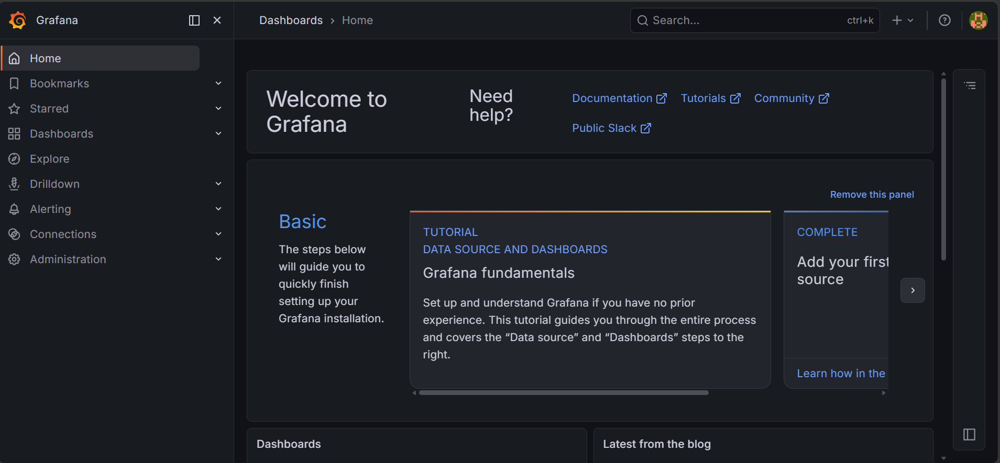
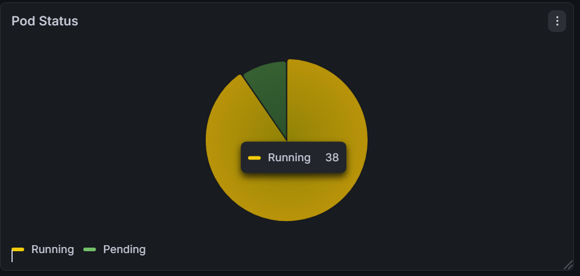
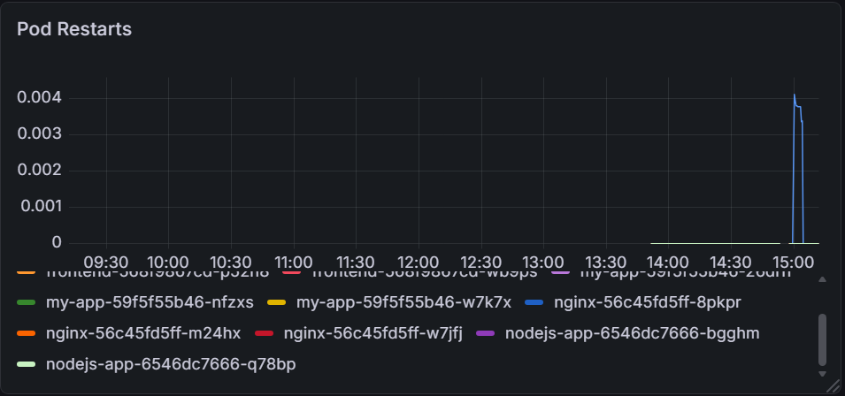
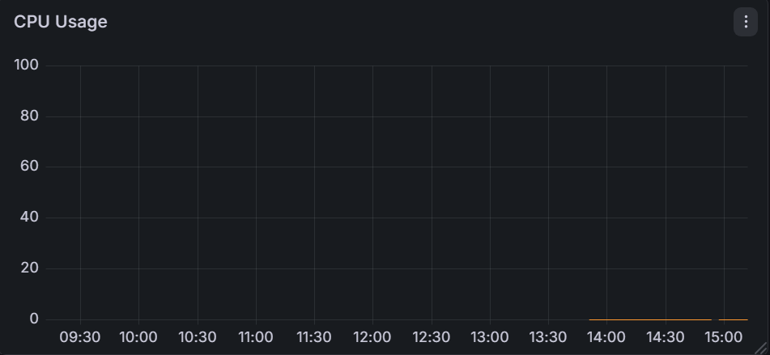
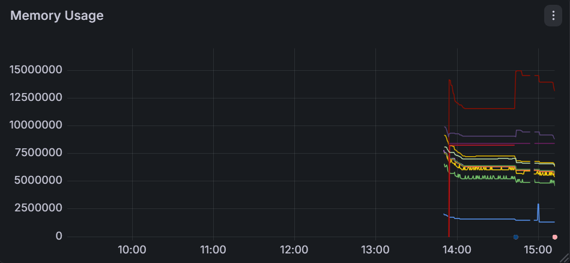
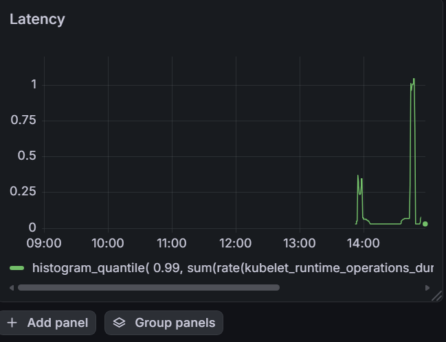

# Grafana Dashboards for Kubernetes Clusters: Pod Health and Latency

## Project Overview

This project demonstrates how to monitor Kubernetes workloads using Prometheus and Grafana. The monitoring stack was deployed on a Kubernetes cluster running on Minikube, while Grafana dashboards were configured to visualize pod health, pod restarts, CPU usage, memory usage, and pod start latency.

The project integrates:

- Kubernetes
- Docker
- Minikube
- Prometheus
- Grafana
- kube-state-metrics

The objective of the project is to provide visibility into Kubernetes pod performance and cluster responsiveness through custom Grafana dashboards.

---

# Technologies Used

- Kubernetes
- Minikube
- Docker
- Prometheus
- Grafana
- Helm
- Node.js
- kube-state-metrics

---

# Project Structure

```text
k8s-grafana-monitoring/
│
├── app/
│   ├── Dockerfile
│   ├── app.js
│   └── package.json
│
├── k8s/
│   ├── deployment.yaml
│   ├── service.yaml
│
├── monitoring/
│   └── grafana-dashboard.json
│
├── images/
│   ├── dashboard-overview.png
│   ├── pod-status.png
│   ├── pod-restarts.png
│   ├── cpu-usage.png
│   ├── memory-usage.png
│   ├── pod-latency.png
│   └── monitoring-pods.png
│
└── README.md
```

---

# Architecture

```text
Dummy Application Pods
        ↓
Prometheus Scrapes Metrics
        ↓
Grafana Visualizes Metrics
```

---

# Step 1: Start Minikube

Start the Kubernetes cluster using Minikube.

```bash
minikube start
```

Verify cluster status:

```bash
kubectl get nodes
```

Expected Output:

```text
NAME       STATUS   ROLES           AGE   VERSION
minikube   Ready    control-plane   XXm   v1.xx.x
```

---

# Step 2: Install Monitoring Stack

Add the Prometheus Helm repository:

```bash
helm repo add prometheus-community https://prometheus-community.github.io/helm-charts
```

Update Helm repositories:

```bash
helm repo update
```

Install Prometheus and Grafana stack:

```bash
helm install monitoring prometheus-community/kube-prometheus-stack \
  --namespace monitoring \
  --create-namespace
```

Verify monitoring pods:

```bash
kubectl get pods -n monitoring
```

---

# Step 3: Access Grafana

Port-forward Grafana service:

```bash
kubectl port-forward svc/monitoring-grafana 3000:80 -n monitoring
```

Access Grafana:

```text
http://localhost:3000
```

Retrieve Grafana admin password:

```bash
kubectl get secret monitoring-grafana -n monitoring \
  -o jsonpath="{.data.admin-password}" | base64 --decode
```

Default username:

```text
admin
```

---

# Step 4: Create Dummy Application

## app.js

```javascript
const express = require('express');
const app = express();

app.get('/', (req, res) => {
  res.send('Kubernetes Monitoring Demo App');
});

app.listen(3000, () => {
  console.log('App running on port 3000');
});
```

---

## package.json

```json
{
  "name": "monitoring-demo",
  "version": "1.0.0",
  "main": "app.js",
  "dependencies": {
    "express": "^4.18.2"
  }
}
```

---

## Dockerfile

```Dockerfile
FROM node:18-alpine

WORKDIR /app

COPY package*.json ./

RUN npm install

COPY . .

EXPOSE 3000

CMD ["node", "app.js"]
```

---

# Step 5: Build Docker Image

Configure Docker to use Minikube Docker daemon:

```bash
eval $(minikube docker-env)
```

Build Docker image:

```bash
docker build -t monitoring-demo .
```

Verify image:

```bash
docker images
```

---

# Step 6: Kubernetes Deployment

## deployment.yaml

```yaml
apiVersion: apps/v1
kind: Deployment
metadata:
  name: monitoring-demo
spec:
  replicas: 3
  selector:
    matchLabels:
      app: monitoring-demo
  template:
    metadata:
      labels:
        app: monitoring-demo
    spec:
      containers:
      - name: monitoring-demo
        image: monitoring-demo
        imagePullPolicy: Never
        ports:
        - containerPort: 3000
```

Deploy application:

```bash
kubectl apply -f deployment.yaml
```

Verify pods:

```bash
kubectl get pods
```

---

# Step 7: Kubernetes Service

## service.yaml

```yaml
apiVersion: v1
kind: Service
metadata:
  name: monitoring-demo-service
spec:
  selector:
    app: monitoring-demo
  ports:
    - protocol: TCP
      port: 80
      targetPort: 3000
  type: NodePort
```

Apply service:

```bash
kubectl apply -f service.yaml
```

Verify service:

```bash
kubectl get svc
```

---

# Step 8: Create Grafana Dashboard

Create a dashboard called:

```text
Kubernetes Pod Health and Latency
```

The dashboard contains the following monitoring panels.

---

# Pod Status Panel

## Purpose

Displays Kubernetes pod phases such as Running, Pending, Failed, and Succeeded.

## Visualization

Pie Chart

## Query

```promql
sum by (phase) (
  kube_pod_status_phase{job="kube-state-metrics"} == 1
)
```

## Expected Result

Most pods should appear in the Running phase.

---

# Pod Restarts Panel

## Purpose

Tracks pod restart frequency to identify unstable containers.

## Visualization

Time Series

## Query

```promql
sum(rate(kube_pod_container_status_restarts_total{namespace="default"}[5m])) by (pod)
```

## Expected Result

Healthy pods should show restart values close to zero.

---

# CPU Usage Panel

## Purpose

Monitors CPU usage for Kubernetes pods.

## Visualization

Time Series

## Query

```promql
sum by (pod) (
  rate(container_cpu_usage_seconds_total{namespace="default", pod!=""}[5m])
)
```

## Expected Result

CPU usage fluctuates depending on workload activity.

---

# Memory Usage Panel

## Purpose

Tracks memory consumption of Kubernetes pods.

## Visualization

Time Series

## Query

```promql
sum by (pod) (
  container_memory_working_set_bytes{namespace="default", pod!=""}
)
```

## Expected Result

Memory usage remains relatively stable during normal operation.

---

# Pod Start Latency Panel

## Purpose

Measures the time required for Kubernetes pods to initialize and start running.

## Visualization

Time Series

## Query

```promql
histogram_quantile(
  0.99,
  sum by (le) (
    rate(kubelet_pod_start_latency_seconds_bucket[5m])
  )
)
```

## Expected Result

Pod startup latency should remain low under healthy cluster conditions.

---

# Step 9: Generate Cluster Activity

To generate visible monitoring data:

Scale deployment up:

```bash
kubectl scale deployment monitoring-demo --replicas=8
```

Scale deployment down:

```bash
kubectl scale deployment monitoring-demo --replicas=2
```

This generates:
- CPU activity
- memory allocation changes
- pod startup events
- latency metrics

---

# Screenshots

## Dashboard Overview



---

## Pod Status



---

## Pod Restarts



---

## CPU Usage



---

## Memory Usage



---

## Pod Start Latency



---

# Monitoring Benefits

This monitoring solution provides:

- Real-time Kubernetes visibility
- Pod health monitoring
- Resource utilization tracking
- Performance troubleshooting
- Latency monitoring
- Cluster observability

---

# Challenges Encountered

During the project, several common Kubernetes monitoring issues were resolved:

- Grafana query configuration
- Kubernetes image pull errors
- Minikube Docker daemon configuration
- Prometheus metric visualization
- Dashboard panel setup
- Pod metric filtering

---

# Conclusion

This project successfully implemented a Kubernetes monitoring stack using Prometheus and Grafana. The dashboard provides insights into pod health, resource usage, and cluster responsiveness. The implementation demonstrates practical DevOps and observability skills commonly used in cloud-native environments.

---

# References

- Prometheus Documentation
- Grafana Documentation
- Kubernetes Documentation
- Helm Charts Documentation
